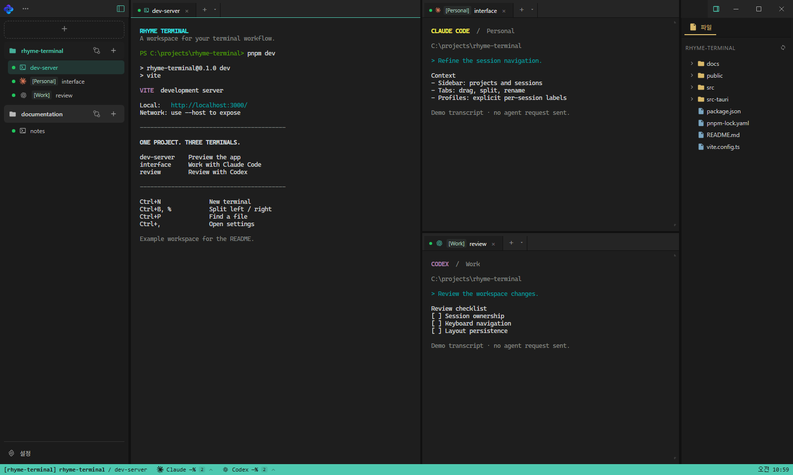
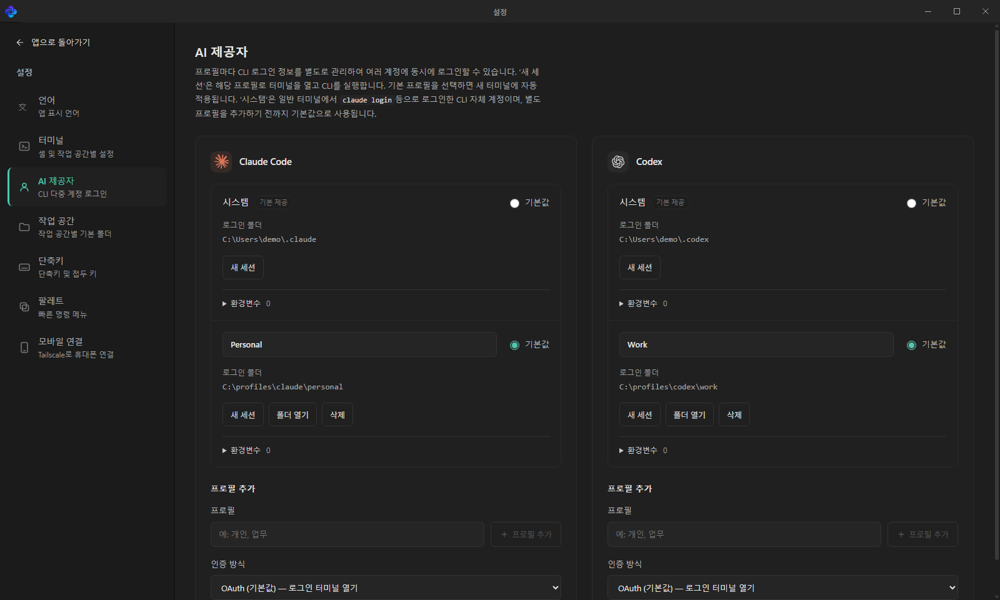
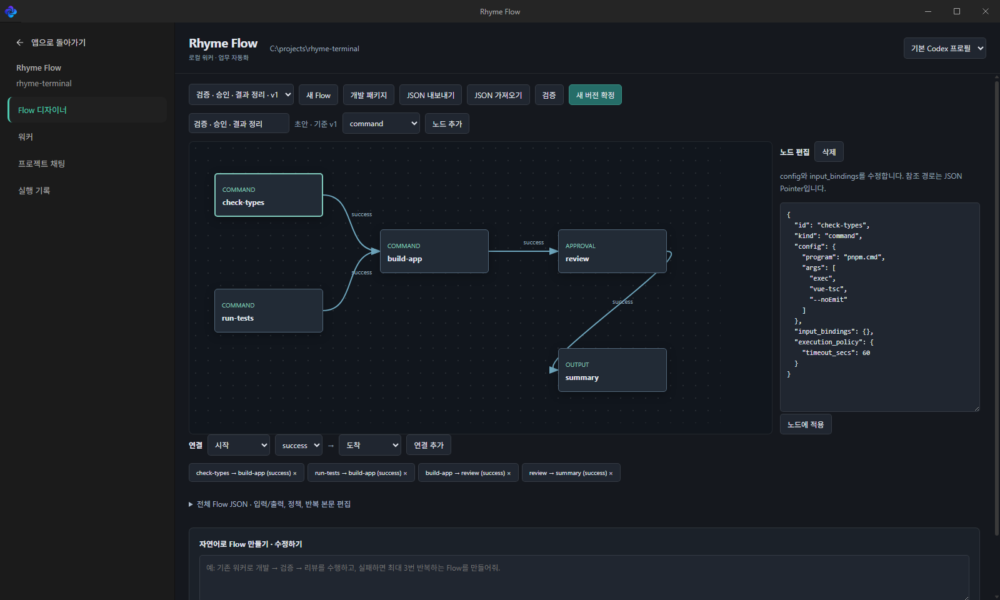

<div align="center">
  
  <h1>Rhyme Terminal</h1>
  <p><strong>터미널, AI 코딩 도구, 프로젝트 작업을 한 화면에.</strong></p>
  <p>Windows용 터미널 멀티플렉서 · 프로젝트별 작업 공간 · 로컬 워크플로 자동화</p>
  <p>
    
    
    
    
  </p>
  <p>
    <a href="#quick-start">빠른 시작</a> ·
    <a href="#features">주요 기능</a> ·
    <a href="docs/rhyme-flow.md">Rhyme Flow</a> ·
    <a href="docs/mobile-pairing.md">모바일 연결</a> ·
    <a href="https://github.com/lafin716/rhyme-terminal/issues">이슈 제보</a>
  </p>
</div>



<p align="center"><sub>현재 프런트엔드를 예제 프로젝트·세션 데이터로 실행해 직접 캡처했습니다. 화면 속 CLI 대화와 출력은 데모이며 실제 에이전트 실행 결과가 아닙니다. <a href="docs/images/README.md">촬영 안내</a></sub></p>

**Rhyme Terminal**은 여러 터미널을 프로젝트별로 묶고, 화면을 나눠 나란히 사용하는 Windows 데스크톱 앱입니다. 개발 서버 옆에 Claude Code와 Codex를 띄우고, 같은 작업 공간에서 파일을 열거나 반복 작업을 Rhyme Flow로 구성할 수 있습니다.

<a id="features"></a>

## 작업에 필요한 도구를 가까이

| 기능 | 할 수 있는 일 |
| --- | --- |
| **분할 터미널** | 가로·세로·4분할, 최대 16개 패널. 탭을 끌어서 순서를 바꾸거나 다른 패널로 이동합니다. |
| **프로젝트 작업 공간** | 프로젝트마다 기본 폴더·셸·레이아웃을 관리합니다. 좌측 세션 목록에서 바로 이동하고, 우클릭으로 이름을 바꾸거나 삭제합니다. |
| **AI 제공자** | Claude Code·Codex의 로그인 프로필과 기본 계정을 관리합니다. 세션별 프로필 태그로 계정을 구분하고, 하단에서 프로필별 사용량을 확인합니다. |
| **파일과 웹 페이지** | 탐색기·빠른 열기·터미널 링크로 파일을 찾습니다. 텍스트 편집과 저장, Markdown·이미지 미리보기, 내장 브라우저 탭을 지원합니다. |
| **키보드 중심 조작** | tmux 스타일 `Ctrl+B` prefix, 사용자 지정 단축키, 터미널 확대·축소, 자주 쓰는 명령 팔레트를 제공합니다. |
| **모바일 연결** | Tailscale을 통해 휴대폰 브라우저를 페어링하고 PC 터미널의 출력을 보거나 입력을 보냅니다. |
| **Rhyme Flow** | 명령·워커·조건·승인 노드를 연결합니다. 버전을 확정해 실행하고 단계별 결과와 실행 기록을 확인합니다. |

### 익숙한 셸, 필요한 프로필

PowerShell, PowerShell 7, Command Prompt, WSL, Git Bash와 사용자 지정 셸을 사용할 수 있습니다. 프로젝트별로 기본 폴더와 셸을 지정하면 새 터미널이 해당 환경에서 시작합니다.

설정의 **AI 제공자**에서 Claude Code·Codex 프로필을 추가하고 기본 프로필을 선택합니다. CLI는 별도로 설치하고 로그인해야 하며, 프로필마다 로그인 폴더를 분리해 여러 계정을 함께 사용할 수 있습니다.

<details>
<summary><strong>AI 제공자 설정 화면 보기</strong></summary>



설정·Rhyme Flow는 독립된 페이지로 열립니다. 상단에는 로고와 창 제어 버튼을 유지하며, 앱으로 돌아오면 기존 터미널 화면을 이어서 사용합니다.

</details>

### 반복 작업은 Rhyme Flow로

프로젝트의 **Rhyme Flow** 버튼을 눌러 Flow 디자이너를 엽니다. 노드를 배치하고 입력·출력과 실행 권한을 정의한 뒤, 검증한 버전을 실행할 수 있습니다.



- **Flow 디자이너** — 노드와 연결 편집, JSON 가져오기·내보내기, 버전 확정.
- **워커** — 지침, 입출력 계약, 권한, 제한 시간을 정의하고 버전별로 관리.
- **프로젝트 채팅** — 요구사항을 업무로 저장하고 후속 변경 사항을 다음 실행에 반영.
- **실행 기록** — 단계별 입력·출력·오류, 승인 요청, 취소와 결과물 확인.

Codex CLI를 통한 자연어 초안 수정도 지원합니다. 개발 패키지는 Worktree → 개발·검증·리뷰 → 승인 → 커밋 → Draft PR 흐름을 제공하며, 검증 명령과 커밋할 파일을 프로젝트에 맞게 설정해야 합니다. 외부 게시에는 실행 권한과 단계 승인이 필요합니다.

[**Rhyme Flow 시작하기 →**](docs/rhyme-flow.md)

### 휴대폰에서도 터미널에 연결

PC 설정의 **모바일 연결**에서 Tailscale IP를 선택하고 서버를 시작합니다. 휴대폰으로 QR을 스캔한 뒤 PC에서 승인하면 세션을 선택해 출력 확인과 입력을 할 수 있습니다. 한글 입력창과 Enter·Tab·Esc·Ctrl+C 보조키를 제공합니다.

모바일 화면은 브라우저에서 열립니다. 직접 IP 연결은 HTTP/WS를 사용하므로 Tailscale 경로를 전제로 하며, PC 앱과 모바일 서버가 실행 중이어야 합니다.

[**페어링 및 연결 문제 해결 →**](docs/mobile-pairing.md)

<a id="quick-start"></a>

## 빠른 시작

현재 저장소의 소스를 Windows에서 빌드하는 방법입니다.

### 준비

- Windows 10/11
- Git, Node.js 22 이상, pnpm
- Rust의 MSVC 툴체인
- Microsoft C++ Build Tools의 **C++를 사용한 데스크톱 개발** 구성 요소와 Windows SDK
- Microsoft Edge WebView2 Runtime

시스템 의존성 설치는 [Tauri의 Windows 준비 안내](https://v2.tauri.app/start/prerequisites/#windows)를 참고하세요. Claude Code·Codex·WSL·Git Bash는 사용할 기능에 맞춰 별도로 설치합니다.

### 소스에서 실행

```powershell
git clone https://github.com/lafin716/rhyme-terminal.git
cd rhyme-terminal
pnpm.cmd install
pnpm.cmd tauri dev
```

pnpm이 없다면 먼저 `npm install -g pnpm`을 실행하세요. 개발 모드에서는 Vite 서버와 Tauri 앱이 함께 실행됩니다.

### 실행 파일 만들기

```powershell
pnpm.cmd build:portable
```

기본 출력 경로는 `src-tauri/target/release/rhyme-terminal.exe`입니다. 현재 빌드 설정은 설치 프로그램 대신 실행 파일을 생성하며, 실행 환경에는 WebView2 Runtime이 필요합니다. `CARGO_TARGET_DIR`를 지정한 경우 출력 위치가 달라집니다.

## 처음 열었다면

1. **프로젝트 추가** — 좌측 `+`로 작업 공간을 만들고, 설정 → 작업 공간에서 기본 폴더를 지정합니다.
2. **터미널 시작** — 프로젝트 옆 `+` 또는 `Ctrl+N`으로 세션을 만듭니다. 터미널 메뉴에서 셸과 AI CLI 프로필을 선택할 수 있습니다.
3. **화면 분할** — 탭을 패널 가장자리로 끌거나 `Ctrl+B` 다음 `%`를 눌러 좌우로 나눕니다.
4. **파일 열기** — `Ctrl+P`로 파일을 찾거나 터미널 출력의 파일 경로를 `Ctrl+클릭`합니다. URL은 내장 브라우저 탭으로 열립니다.
5. **작업 이어가기** — 창 닫기는 트레이로 숨기기입니다. 앱을 완전히 종료하려면 트레이 메뉴를 사용합니다.

## 자주 쓰는 조작

아래는 기본 설정입니다. 설정 → **단축키**에서 일반 단축키와 prefix 키를 변경할 수 있습니다. `Ctrl+B → %`는 두 키 조합을 순서대로 누른다는 뜻입니다.

| 동작 | 기본 입력 |
| --- | --- |
| 새 터미널 | `Ctrl+N` 또는 `Ctrl+B → c` |
| 좌우 / 상하 분할 | `Ctrl+B → %` / `Ctrl+B → "` |
| 해당 방향으로 탭 이동 또는 분할 | `Ctrl+Alt+방향키` |
| 현재 패널의 다음 / 이전 탭 | `Ctrl+B → n` / `Ctrl+B → p` |
| 세션 이름 변경 | 세션 우클릭 → 이름 변경 또는 `Ctrl+B → ,` |
| 왼쪽 / 오른쪽 패널 표시 전환 | `Ctrl+Shift+B` / `Ctrl+Shift+E` |
| 빠른 파일 열기 | `Ctrl+P` |
| 파일 저장 | `Ctrl+S` |
| 터미널 확대 / 축소 | `Ctrl+Shift++` / `Ctrl+Shift+-` 또는 `Ctrl+Shift+휠` |
| 설정 | `Ctrl+,` |

prefix의 `c`, `n`, `p`는 Shift 없이 누릅니다. `Ctrl+B → Shift+C`는 Claude 실행 동작입니다.

터미널 영역에서 마우스 가운데 버튼을 누르면 명령 팔레트를 열 수 있습니다. 설정 → **팔레트**에서 자주 쓰는 명령과 자동 실행 여부를 관리합니다.

## 개발과 기여

```powershell
pnpm.cmd test                                      # 프런트엔드 테스트
pnpm.cmd build                                     # 모바일 자산 + 타입 검사 + 프런트엔드 빌드
cargo test --manifest-path src-tauri/Cargo.toml --lib
cargo check --manifest-path src-tauri/Cargo.toml --all-targets
```

`pnpm.cmd dev`는 프런트엔드 서버만 실행합니다. 실제 PTY·파일 시스템·모바일 연결을 함께 확인하려면 `pnpm.cmd tauri dev`를 사용하세요.

| 경로 | 역할 |
| --- | --- |
| [`src/components/`](src/components/) | Vue UI: 터미널, 탐색기, 설정, Flow 페이지 |
| [`src/composables/`](src/composables/) | 작업 공간·세션·설정 상태와 동작 |
| [`src/lib/`](src/lib/) | 단축키, 레이아웃 타입, Tauri 브리지, 공통 로직 |
| [`src-tauri/src/pty/`](src-tauri/src/pty/) · [`ipc/`](src-tauri/src/ipc/) | PTY 세션과 Windows named-pipe 통신 |
| [`src-tauri/src/flow/`](src-tauri/src/flow/) | Rhyme Flow 모델, 저장소, 실행 엔진 |
| [`src/mobile/`](src/mobile/) | 모바일 브라우저 UI |

버그를 발견했다면 [이슈](https://github.com/lafin716/rhyme-terminal/issues)에 재현 단계와 Windows·셸 버전, 기대한 동작을 남겨 주세요. 변경 제안이나 PR에는 관련 화면과 검증 결과를 함께 적어 주세요.

<details>
<summary><strong>CLI와 데이터 저장 위치</strong></summary>

GUI와 별도로 `winmuxctl` CLI와 `winmuxd` 데몬을 빌드할 수 있습니다. 내부 실행 파일명과 저장 키는 기존 `winmux` 식별자를 유지합니다.

```powershell
cargo build --manifest-path src-tauri/Cargo.toml --release --bin winmuxctl --bin winmuxd
.\src-tauri\target\release\winmuxctl.exe ls
.\src-tauri\target\release\winmuxctl.exe ping
```

데몬은 필요할 때 자동으로 시작합니다. GUI 실행 파일은 별도 `winmuxd.exe`가 없으면 자체 데몬 모드로 실행할 수 있습니다.

| 데이터 | 위치 |
| --- | --- |
| 작업 공간·환경설정·단축키·팔레트 | 앱 WebView의 localStorage, `winmux:{domain}:v1` |
| 데몬 로그 | `%LOCALAPPDATA%\winmux\logs\winmuxd.log` |
| Flow 정의·업무·실행 기록 | Tauri local-data 경로의 `flow/flow.sqlite3` |

Flow 실행은 앱 프로세스가 살아 있는 동안 유지됩니다. 앱이 종료된 뒤 다시 시작하면 미완료 실행을 `interrupted`로 처리하며 자동 재실행하지 않습니다.

</details>

<details>
<summary><strong>실행이 잘되지 않을 때</strong></summary>

- **빌드 실패** — Rust MSVC 툴체인, C++ Build Tools, Windows SDK와 WebView2 설치를 확인합니다.
- **터미널 생성 실패** — 설정 → 터미널의 프로그램 경로와 프로젝트 기본 폴더를 확인합니다. PowerShell 7은 `pwsh.exe`, Windows PowerShell은 `powershell.exe`입니다.
- **Git Bash 즉시 종료** — Git Bash 프리셋을 다시 선택하고 실행 인수 `--login`, `-i`를 확인합니다.
- **WSL 실행 실패** — 일반 PowerShell에서 `wsl.exe --status`와 `wsl.exe`가 동작하는지 확인합니다.
- **모바일 접속 실패** — 선택한 IP·포트, Tailscale 연결, Windows 방화벽을 확인합니다. 서버 재시작 후에는 새 QR로 페어링합니다.

자세한 연결 절차는 [모바일 문서](docs/mobile-pairing.md), Flow 설정과 실행 조건은 [Rhyme Flow 문서](docs/rhyme-flow.md)를 참고하세요.

</details>

---

Tauri · Vue · xterm.js · Monaco Editor · Rust로 만듭니다. README 구성은 [Orca](https://github.com/stablyai/orca)의 짧은 소개와 기능별 안내를 참고했습니다.
